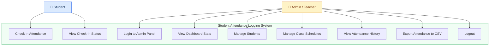
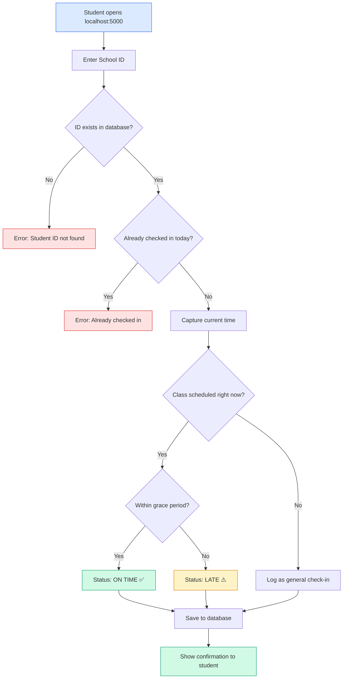
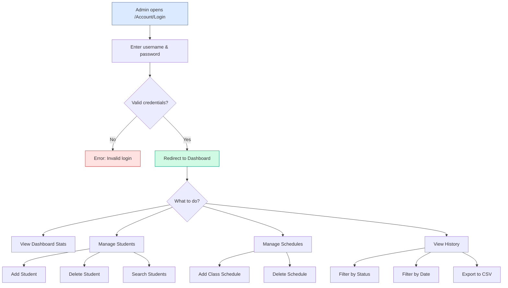
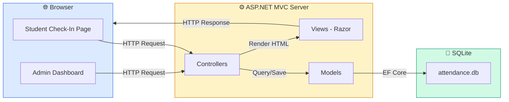
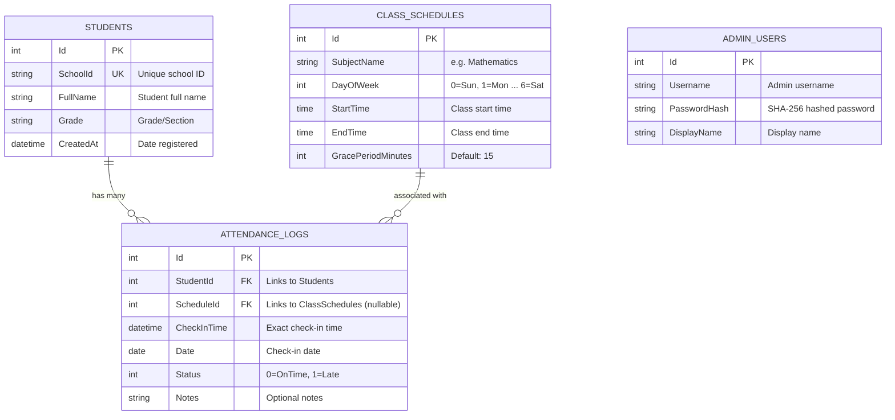
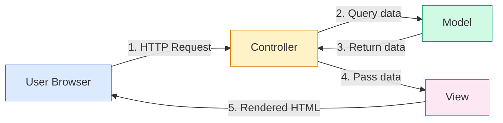

# 📘 Student Attendance Logging System

### Cebu Eastern College — Final Project
### Bachelor of Science in Information Technology

---

## Table of Contents

1. [Project Overview](#project-overview)
2. [System Features](#system-features)
3. [Technology Stack](#technology-stack)
4. [Prerequisites & Installation](#prerequisites--installation)
5. [How to Run the System](#how-to-run-the-system)
6. [How the System Works](#how-the-system-works)
7. [Use Case Diagram](#use-case-diagram)
8. [System Flow Diagrams](#system-flow-diagrams)
9. [Database Schema](#database-schema)
10. [Project Structure](#project-structure)
11. [Code Walkthrough](#code-walkthrough)
12. [Default Credentials](#default-credentials)
13. [Troubleshooting](#troubleshooting)
14. [References](#references)

---

## Project Overview

The **Student Attendance Logging System** is a web-based application designed to streamline the attendance process in educational institutions. Built with **C# ASP.NET MVC** and **SQLite**, the system ensures fast, accurate tracking while eliminating the risk of data loss associated with traditional manual records.

### Problem Statement

Manual attendance recording using paper-based systems is:
- **Time-consuming** — Teachers spend valuable class time calling names
- **Error-prone** — Handwriting mistakes, lost papers, miscounted records
- **Hard to analyze** — No quick way to generate reports or check trends

### Solution

This system provides:
- **Automated attendance logging** — Students check in with their School ID
- **Real-time status detection** — System automatically determines if a student is **On Time** or **Late** based on the class schedule
- **Admin dashboard** — Instant visibility into attendance statistics
- **History & export** — CSV export for records and reporting

---

## System Features

| Feature | Description |
|---|---|
| **Student Check-In** | Students enter their School ID on the public-facing page; time is captured automatically |
| **On Time / Late Detection** | System compares check-in time against the class schedule + grace period |
| **Admin Dashboard** | Overview cards showing total students, checked in today, on time count, late count |
| **Student Management** | Admin can add and delete student records with search functionality |
| **Class Schedule Management** | Admin defines subjects, day of week, start/end time, and grace period |
| **Attendance History** | Filterable log of all check-ins with date and status filters |
| **CSV Export** | Download attendance records as a CSV file for reporting |
| **Authentication** | Secure admin login with hashed passwords and cookie-based sessions |

---

## Technology Stack

| Technology | Purpose |
|---|---|
| **C# / .NET 8.0** | Backend programming language and framework |
| **ASP.NET MVC** | Web application framework (Model-View-Controller pattern) |
| **Entity Framework Core** | ORM (Object-Relational Mapper) for database operations |
| **SQLite** | Lightweight file-based database (no separate server needed) |
| **Razor Views** | Server-side HTML templating engine |
| **HTML / CSS / JavaScript** | Frontend structure, styling, and interactivity |
| **Lucide Icons** | Modern SVG icon library for the user interface |

### Why SQLite?

SQLite is a **file-based database** — the entire database is stored in a single file (`attendance.db`). This means:
- ✅ No need to install a separate database server (like MySQL or SQL Server)
- ✅ Easy to share — just copy the file
- ✅ Perfect for small-to-medium applications
- ✅ Zero configuration needed

---

## Prerequisites & Installation

### Step 1: Install .NET 8.0 SDK

The .NET SDK is what allows you to build and run C# applications.

**For Windows:**
1. Go to: https://dotnet.microsoft.com/en-us/download/dotnet/8.0
2. Click **".NET SDK x64"** under the Windows column
3. Run the downloaded installer
4. Follow the installation wizard (just click Next → Next → Install)

**For macOS:**
1. Go to the same link above
2. Download the macOS installer
3. Open the `.pkg` file and follow the instructions

**For Linux (Ubuntu/Debian):**
```bash
sudo apt-get update
sudo apt-get install -y dotnet-sdk-8.0
```

### Step 2: Verify Installation

Open a terminal (Command Prompt on Windows, Terminal on macOS/Linux) and type:

```bash
dotnet --version
```

You should see something like `8.0.xxx`. If you see an error, the SDK is not installed correctly.

### Step 3: Install a Code Editor (Optional)

We recommend **Visual Studio Code** for viewing and editing the code:
1. Download from: https://code.visualstudio.com/
2. Install the **C# extension** from the Extensions marketplace

### Step 4: Clone or Download the Project

If using Git:
```bash
git clone <repository-url>
cd Student-Attendance-System/AttendanceSystem
```

Or download the ZIP file and extract it.

### Step 5: Restore Dependencies

Navigate to the `AttendanceSystem` folder in your terminal and run:

```bash
cd AttendanceSystem
dotnet restore
```

This downloads all the required NuGet packages (libraries) that the project depends on.

---

## How to Run the System

### Starting the Server

```bash
cd AttendanceSystem
dotnet run --urls "http://localhost:5000"
```

You should see output like:
```
Now listening on: http://localhost:5000
Application started. Press Ctrl+C to shut down.
```

### Accessing the System

| Page | URL | Who |
|---|---|---|
| Student Check-In | `http://localhost:5000` | Students |
| Admin Login | `http://localhost:5000/Account/Login` | Admin |
| Dashboard | `http://localhost:5000/Dashboard` | Admin |
| Students | `http://localhost:5000/Students` | Admin |
| Schedules | `http://localhost:5000/Schedules` | Admin |
| History | `http://localhost:5000/History` | Admin |

### Stopping the Server

Press `Ctrl + C` in the terminal.

---

## How the System Works

### For Students

1. Student opens `http://localhost:5000` on any device (phone, laptop, tablet)
2. Student enters their **School ID** in the form
3. The system **automatically captures the current date and time** (no manual entry)
4. The system checks:
   - Is there a class scheduled right now for today's day of the week?
   - If yes → compare the check-in time with the class start time + grace period
   - If the student checked in within the grace period → **On Time**
   - If the student checked in after the grace period → **Late**
5. A confirmation message shows the student's name, status, and subject

> **Note:** Each student can only check in **once per day**. If they try again, the system will show "You have already checked in today!"

### For Admin (Teacher/Instructor)

1. Admin logs in at `/Account/Login` using credentials
2. **Dashboard** — View real-time statistics
3. **Students** — Register new students by entering their School ID, Full Name, and Grade/Section
4. **Schedules** — Define class schedules (e.g., "Mathematics" on "Monday" from "8:00 AM" to "9:30 AM" with a 15-minute grace period)
5. **History** — View all attendance logs, filter by status or date, export to CSV

### The Grace Period Explained

The grace period is set per class schedule and determines the cutoff for "On Time":

```
Class Start: 8:00 AM
Grace Period: 15 minutes
Deadline:     8:15 AM

Check in at 8:10 AM → ✅ On Time
Check in at 8:20 AM → ⚠️ Late
```

---

## Use Case Diagram



---

## System Flow Diagrams

### Student Check-In Flow



### Admin Workflow



### System Architecture



---

## Database Schema

### Entity Relationship Diagram



### Table Descriptions

| Table | Purpose |
|---|---|
| **Students** | Stores registered student information (School ID, name, grade) |
| **ClassSchedules** | Defines when classes happen (subject, day, time, grace period) |
| **AttendanceLogs** | Records every check-in with timestamp and auto-detected status |
| **AdminUsers** | Stores admin login credentials with hashed passwords |

---

## Project Structure

```
AttendanceSystem/
│
├── Program.cs                          ← App entry point & configuration
├── AttendanceSystem.csproj             ← Project file (dependencies)
├── attendance.db                       ← SQLite database file (auto-created)
├── DOCUMENTATION.md                    ← This file
│
├── Controllers/                        ← Handle HTTP requests (the "C" in MVC)
│   ├── HomeController.cs               ← Student check-in logic
│   ├── AccountController.cs            ← Admin login/logout
│   ├── DashboardController.cs          ← Dashboard statistics
│   ├── StudentsController.cs           ← CRUD operations for students
│   ├── SchedulesController.cs          ← CRUD operations for class schedules
│   └── HistoryController.cs            ← Attendance logs + CSV export
│
├── Models/                             ← Data structures (the "M" in MVC)
│   ├── Student.cs                      ← Student entity
│   ├── ClassSchedule.cs                ← Class schedule entity
│   ├── AttendanceLog.cs                ← Attendance log entity + Status enum
│   ├── AdminUser.cs                    ← Admin user entity
│   └── ViewModels/
│       └── ViewModels.cs               ← Data transfer objects for views
│
├── Data/
│   └── AppDbContext.cs                 ← Database context (EF Core + SQLite)
│
├── Views/                              ← HTML templates (the "V" in MVC)
│   ├── _ViewStart.cshtml               ← Sets default layout
│   ├── _ViewImports.cshtml             ← Shared using statements
│   ├── Shared/
│   │   └── _Layout.cshtml              ← Master layout (sidebar + nav)
│   ├── Home/
│   │   └── Index.cshtml                ← Student check-in page
│   ├── Account/
│   │   └── Login.cshtml                ← Admin login page
│   ├── Dashboard/
│   │   └── Index.cshtml                ← Dashboard with stat cards
│   ├── Students/
│   │   └── Index.cshtml                ← Student list + add modal
│   ├── Schedules/
│   │   └── Index.cshtml                ← Schedule list + add modal
│   └── History/
│       └── Index.cshtml                ← Attendance log table + filters
│
└── wwwroot/                            ← Static files served to the browser
    └── css/
        └── site.css                    ← Main stylesheet (white theme)
```

---

## Code Walkthrough

### 1. Program.cs — The Starting Point

This is where the app boots up. It does three things:
- Configures **SQLite** as the database
- Sets up **cookie authentication** for admin login
- **Auto-creates the database** on first run

### 2. Models — The Data Layer

**What is a Model?** A model is a C# class that represents a table in the database. Each property = a column.

Example — `Student.cs`:
```csharp
public class Student
{
    public int Id { get; set; }            // Auto-generated primary key
    public string SchoolId { get; set; }   // Unique school ID (e.g., "STU-001")
    public string FullName { get; set; }   // Student's full name
    public string Grade { get; set; }      // Grade/Section (e.g., "Grade 10")
    public DateTime CreatedAt { get; set; } // When the student was registered
}
```

### 3. Controllers — The Logic Layer

**What is a Controller?** A controller handles what happens when a user visits a URL. It processes the request, talks to the database, and returns a view (HTML page).

Example — When a student checks in, `HomeController.cs`:
1. Receives the School ID from the form
2. Looks up the student in the database
3. Checks if they already checked in today
4. Finds today's class schedule
5. Compares check-in time vs. schedule to determine On Time / Late
6. Saves the attendance log
7. Returns the result to the page

### 4. Views — The Presentation Layer

**What is a View?** A `.cshtml` file is an HTML template that can include C# code using `@` syntax. The server processes these and sends pure HTML to the browser.

### 5. AppDbContext.cs — The Database Bridge

This file connects C# code to the SQLite database using **Entity Framework Core**. Instead of writing raw SQL queries, you write C# code like:
```csharp
// Find a student by their school ID
var student = await _db.Students
    .FirstOrDefaultAsync(s => s.SchoolId == "STU-001");
```

And EF Core automatically translates it to SQL:
```sql
SELECT * FROM Students WHERE SchoolId = 'STU-001' LIMIT 1;
```

### 6. MVC Pattern Explained



| Component | Role | Files |
|---|---|---|
| **Model** | Defines data structure + database | `Models/*.cs`, `Data/AppDbContext.cs` |
| **View** | Displays HTML to the user | `Views/**/*.cshtml` |
| **Controller** | Handles requests + business logic | `Controllers/*.cs` |

---

## Default Credentials

| Role | Username | Password |
|---|---|---|
| Admin | `admin` | `admin123` |

> ⚠️ **Important:** In a production environment, change the default password immediately. The password is stored as a SHA-256 hash in the database, not in plain text.

---

## Troubleshooting

### "dotnet: command not found"
→ The .NET SDK is not installed or not in your PATH. Re-install from https://dotnet.microsoft.com/download

### "Port 5000 is already in use"
→ Another application is using port 5000. Either stop it or use a different port:
```bash
dotnet run --urls "http://localhost:5001"
```

### "Student ID not found"
→ The student must be registered by the admin first. Go to **Students** page in the admin panel and add the student.

### "Already checked in today"
→ Each student can only check in once per day. Delete the `attendance.db` file and restart the server to reset all data.

### Database got corrupted / want to start fresh
→ Delete the `attendance.db` file in the project folder and restart the server. A new empty database will be created automatically.

---

## References

| Resource | Link |
|---|---|
| ASP.NET MVC Documentation | https://learn.microsoft.com/en-us/aspnet/core/mvc/overview |
| Entity Framework Core | https://learn.microsoft.com/en-us/ef/core/ |
| SQLite Documentation | https://www.sqlite.org/docs.html |
| .NET 8.0 Download | https://dotnet.microsoft.com/en-us/download/dotnet/8.0 |
| Lucide Icons | https://lucide.dev/ |
| C# Language Guide | https://learn.microsoft.com/en-us/dotnet/csharp/ |
| Razor Syntax Reference | https://learn.microsoft.com/en-us/aspnet/core/mvc/views/razor |
| MVC Design Pattern | https://en.wikipedia.org/wiki/Model%E2%80%93view%E2%80%93controller |

---

> **Student Attendance Logging System** — Cebu Eastern College Final Project  
> Built with C# ASP.NET MVC + SQLite
